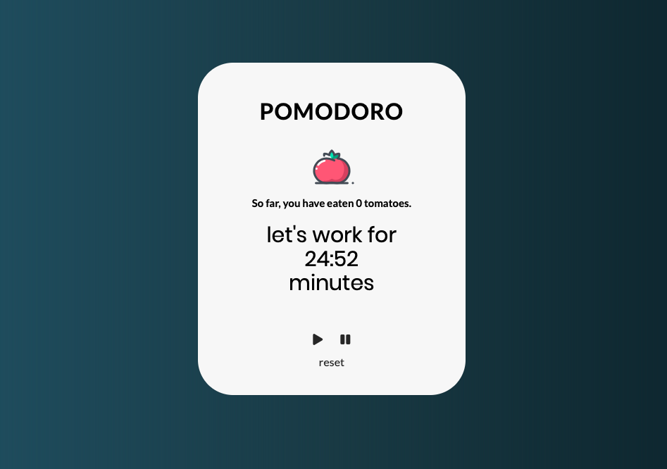

# Pomodoro timer
Pomodoro timer is a time management method. It uses a timer to break down work into intervals. Traditionally they last 25 minutes and are separated by short breaks (every 25 minutes) and long breaks (after 4 work cycles).

[Website demo](https://agatapst.github.io/pomodoro_timer)

## Table of Contents
- General info
- Technologies
- Additional info

### General info
Project is a simple app for time management caled _The Pomodoro Technique_. It uses a timer to break down work into intervals, 25 minutes in length, separated by short 5 minutes breaks. After 4 full work cycles (25 minutes of work + 5 minutes of rest), there is 15 minutes break. User can also use pause/start and reset feature. There is also counter of number of intervals. The app contains sound effects.

### Technologies
- CSS3
- HTML5
- JavaScript

### Additional info
The whole app structure and project layout were designed by me.

Tomato icon was downloaded from [Icons8](https://icons8.com).